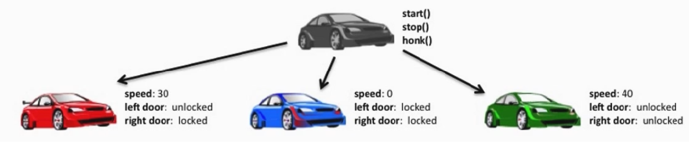

#Classes, Instances, Type, Methods and Attributes.

> - Class: A blueprint for an instance
> - Instance: A constructed object of the class
> - Type: Indicates the class the instance belongs to
> - Attribute: Any object value; object.attribute
>- Method: A "callable attribute" defined in the class

EXAMPLE:
```py
[1] var = 'hello, world'
[2] print(type(var))
>> <type 'str'>
-
[3] print(var.upper())
>> 'HELLO, WORLD'
```
In this example <b>var</b> is ***string object***, So we can say that it is of the *****string class***** and that it is of 
*****type String*****. We can also call it a string object or a string instance.

On the last line, line 3, we can say that we are calling upper method on string object or instance  
  
### Instance Method and Attributes



> - A "car" can be seen as a class object
> - The car class provides the blueprint for a car object
> - Each instance of a car does the same thing (methods)
> - But, each car instance has it own state (attributes).

Each instance has its own data; object is a unit of data with associated functionality.

Each car can stop start and honk. In code these would be rendered as methods but once they come out of the factory each car has other attributes
which are specific to that car the cars speed for example or whether its doors are open and closed.
Once the instance is constructed it can set its own values to its attributes.

# Defining A Class; Constructing an Instance

* ###Review: class
    + Clases are "instance factories"
    + Classes define an "instance factory"
* ### Construct an instance of object of the class
    + Instances know to which class they belong to ("type")
    + Instances can access variable defined in class

* ### 6 Points To Understanding class
    + An instance of a class knows what class its from.
    + Vars defined in the class are available to the instances
    + A method on an instance passes instance as the first argument to the method (named self in the method)
    + Instances have their own data, called instance attributes
    + When we read an attribute, Python looks for it first in the instance, then the class.

# Instance Methods
> - Instance methods are variables defined in class
> - They are access through the instance; **instance.method()**
> - When called through the instance, the instance is automatically passed as the first argument to the method
> - Because of this automatic passing of the instance, instance method are known as "bound" methods.

```python
class Erick(object):
    greeting = 'Hello, Erick'

    def callme(self):
        print("Calling the 'call me' method with instance: ")
        print("This is the instance obj memmory allocated: {} ".format(self))
        
this_erick = Erick()

print(this_erick) # Showing that the instance gets passed as first argument
this_erick.callme() 

print(this_erick.greeting) # Showing that instances have access to class variable
```

# Instance Attributes
In this lesson, we are going to see how object themselves have their own attributes

> ###What is an object?
> - An object is a unit of data (having one or more attribute) of a particular class type, with associated functionality
(methods).

***Remember: Self is the is the instance upon which the method was called***
####Instance Attributes
> - We have seen that instance can access variable defined in class.
> - An instance can also get and set values in itself.
> - Because those values depend on what happens to the object, we call these values state.
> - Instance data takes form from instance attribute values, set and accessed through **object.attribute** syntax.

# Encapsulation
> - Encapsulation: The first of three pillars of OOP.
> - Encapsulation refers to the safe storage of data (as attributes) in an instance.
> - Data can only be accessed through instance methods.
> - Data should be validated as correct (depending on the requirements set in class methods).
> - Data should be safe from changes by external processes.

### Breaking Encapsulation
> - Although normally set in the setter method, instance attribute value can be set anywhere.
> - Encapsulation in Python is a voluntary restriction.
> - Python does not implement data hiding, as other languages do.

```python
class MyClass(object):
""" Set val can be reffered to as the setter method, two arguments;
     first being the implicit first argument, the second 
     argument being setting it as an attribute in the 
     instance called value"""
     
    def set_val(self, val):
        self.value = val
    
    def get_val(self):
        return self.value
```

You can set a instance attribut direcly in the main part of the code, but by using methods we can ensure the integrity
of the instance attributes. Encapsulating the instance ensures the integrity of its data.

For example:
```python
class MyClass(object):
    def set_val(self, val):
    try:
        self.value = int(val)
    except ValueError:
        return
    self.val = val
    
    def get_val(self):
        return self.val
    
    def increment_cal(self):
        self.val = self.val + 1
```

# The "\_\_init\_\_" Constructor
***Allows use to initialize attributes at the time the instance is constructed***

> - **\_\_init\_\_** is a keyword variable: it must be named init.
> - It is a method called automatically when new instance is constructed.
> - If it not present, it is not called.
> - The self argument is the first to appearance of the instance.
> - **\_\_init\_\_** offers the opportunity to initialize attributes in the instance at the time of contruction.


Init is short-hand for "initialization"  

The double underscrores before and after the name signify private or magic method , its called private because intended
to be used internally and not called by the user class and is called magic because its called automatically

#Class Attribute
> ###Class Attributes VS. Instance Attrributes
> - Attributes/Variables in the class are accessible through the instance
> - Instance attributes can also be accessible by the instance
> * We use the syntax **object.attribute**, we're asking Python to look up the attribute
>    + First in the instance
>    + Then in the class
> - Method calls through the instance follow this look up.

# Woking with class and instance data

Instance have access to their own individual value, but they will also have access to class data, therefore class data is
intended to be shared among instances.