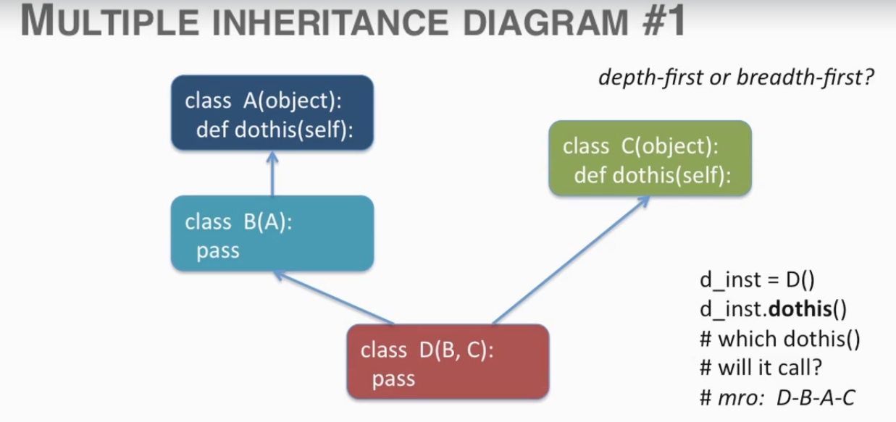
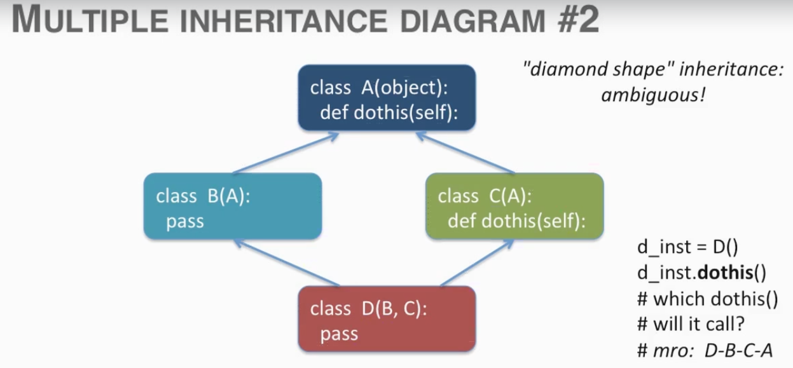

# Inheritance

> - ****Inheritance:**** The second pillar of OOP.
> * Once class can inherit from an other.
>  + The class' attributes are inherited.
>  + In particular, its methods are inherited.
>  + This mean that the instance of an inheriting (child) class can access attributes of the inherited (parent) class.
> - This is simply an other level of attribute lookup: The instance, the class, then the inherited class.

Inheritance the ability to have one class inherit the attributes from another class.

```python
class Date(object): # Inherits form obj
    def get_date(self):
        return "2018-5-25"

class Time(Date): # Inherits from 'Date' class
    def get_time(self):
        return "16:21:00"

dt = Date()
print(dt.get_date())

tm = Time()
print(tm.get_time())
print(tm.get_date())# found method id the 'Date' class
```

### Object.Attribute Lookup hierarchy
- The instance
- The class
- Any class from which this class inherits

> ### Some Inheritance Terms
>* An inheriting class
>  + Child Class
>  + Derived Class
>  + Subclass
>* An inherited class
>  + Parent Class
>  + Base Class
>  + Superclass

###Inheritance Hierachy
> - Classes can be organized into an inheritance hierarchy
> - A child class can access the attributes of all parent (grandparent, etc.) classes
> - Inheritance promotes code collaboration and reuse
> - *****"NO CODE SHOULD APPEAR TWICE"***** 


# Polymorphism
> ###Polymorphism ("many shape")
> - The third pillar of OOP.
> - Two classes with same interface (i.e., method name).
> - Methods are often different, but conceptually similar.
> - Allows expressiveness in design: we can say that the group of related classes implement the same action
> - Duck typing refers to reading an object's attributes to decide whether its of proper type, rather then checking the 
type itself

# Inheriting the contructor
> - ****\_\_init\_\_**** is like any other method; it cqan be inherited.
> - If class does not have ****\_\_init\_\_**** constructor, Python will check the parent class to see if it can find
one.
> - We use the ****super()**** functions to call methods from the parent class.
> - We may initialize in the parent or our own class.
---
# Multiple Inheritance And The Lookup Tree

> - Any class can inherit from multiple classes.
> - Python normally use 'depth-first' order when searching inheriting classes.
> - But when two classes inherit from the same class, Python eliminates the first mention of that class from the mro 
(metod resolution order)
> - the above applies to 'new style' classes (inheriting from object)



> In a depth-first look up, in first searches the first refrence class and its parents, when done, the use the second 
refrenced class.



> After python 2.3, the method resolution order, where to parent classes inherited from the same grandfather class, python 
started removing the earlier appearances of multiple references to classes (or first, in this example, the first A).
this is know as 'Diamond shape'

# Decorators, Static And Class Methods

> - A class method takes the class (not instance) as argument and works with class the class object.
> - A static method requires no argument and does not work with the class or instance (but still belongs in the class 
code).
> - A decorator is a processor the that modifies a function.
> - **@classmethod** and **@staticmethod** modify the default binding that the instance methods provide.

# Abstract Base Classes
> - An abstract class is a kind of model for other classes to be defined. It is not designed to construct instances, but
can be subclassed by regular classes.
> - Abstract classes can define an *interface*, or methods that must be implemented by its subclasses.
> - The python ****abc**** module enables the creation of abstract classes.
> - For information, see the abc module and related docs.

# Method Overloading
> * When working with a child class we can choose to implement parent class method in different ways.
>   + Inherit: Simply use the parent class' methods.
>   + Override/Overload: Provides child own version of method.
>   + Extend: Do work in addition to that in parent method.
>   + Provide: implement abstract methods that parent requires. 

```python
import abc
class GetSetParent(object):
    __metaclass__ = abc.ABCMeta
    def __init__(self, value):
        self.val = 0
    def set_val(self, value):
        self.val = value
    def get_val(self):
        return self.val
    @abc.abstractmethod
    def showdoc(self):
        return
```
> - GetSetParent will stand as abstract class but contain methods.
> - GetSetParent also contains methods that can be inherited by child classes
> - Child classes of GetSetParent have the option to use its methods or get to override or specialize the behavior
 depending on what we want each class to do.
> - This is a both library and a contract
 
 *ADD REST OF EXAMPLE CODE NOTES*

# Class Composition

> ###Composition VS. Inheritance
> - Inheritance can be brittle (a change may require a change elsewhere)
> - Decoupled code is classes, functions, etc. that work independently and do not depend on each other.
> - As long as interface is maintained, interaction between classes will work.
> - Not checking or requiring particular types is polymorphic and Pythonic.

